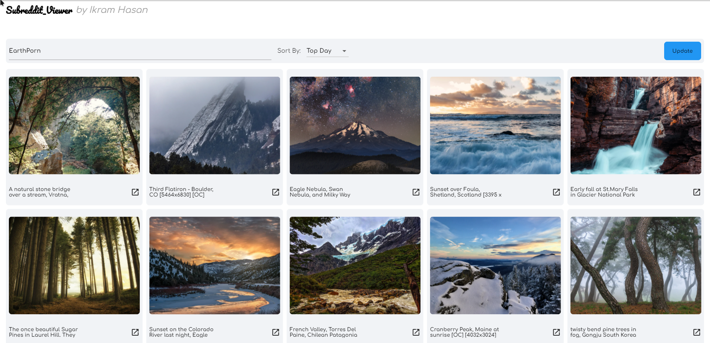

# Subreddit Viewer

A subreddit viewer made using Flutter and Dart ❤.

## Website

To see the app in action, click [here](https://earthquake-visualization.web.app/#/)

## App preview

 

## My Socials

[![Twitter][1.1]][1]
[![Facebook][2.1]][2]
[![Github][3.1]][3]

[1.1]: http://i.imgur.com/tXSoThF.png "twitter icon with padding"
[2.1]: http://i.imgur.com/P3YfQoD.png "facebook icon with padding"
[3.1]: http://i.imgur.com/0o48UoR.png "github icon with padding"

[1]: http://www.twitter.com/ikramhasandev
[2]: http://www.facebook.com/ihni7/
[3]: https://github.com/ikramhasan/
